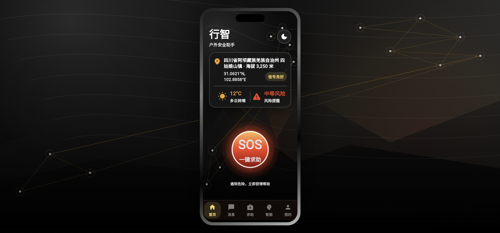
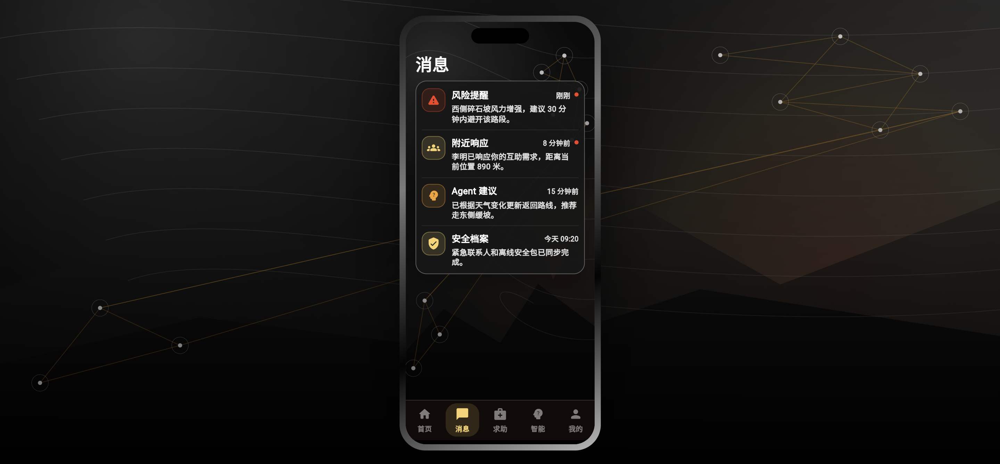
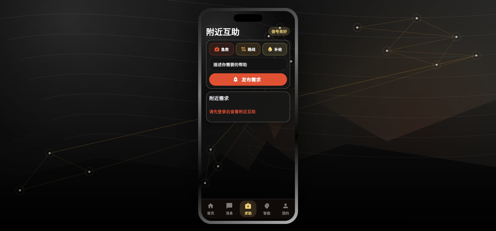
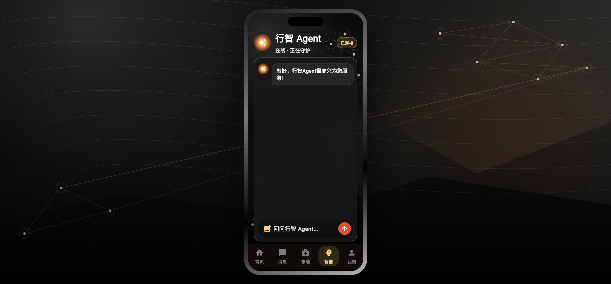
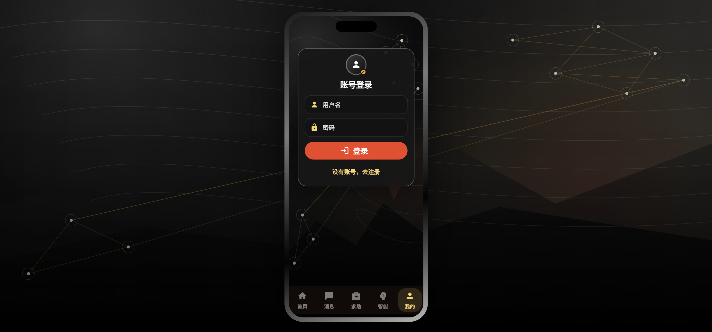
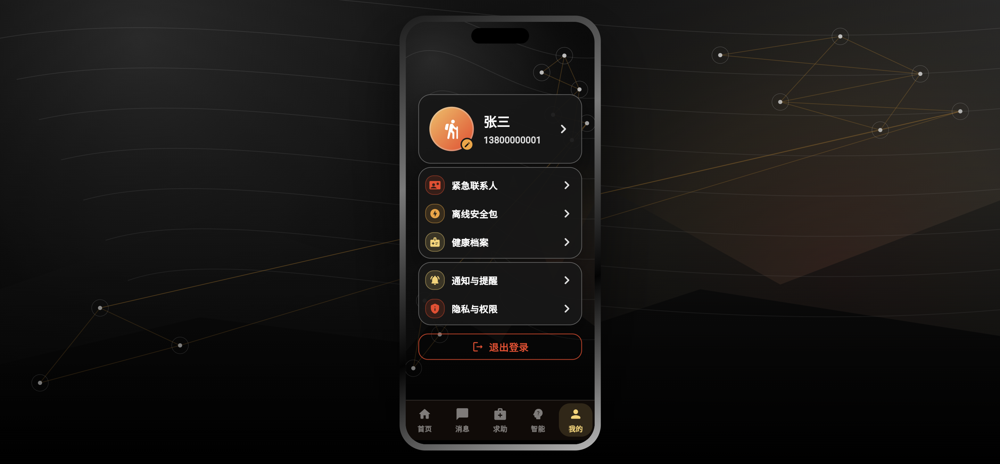
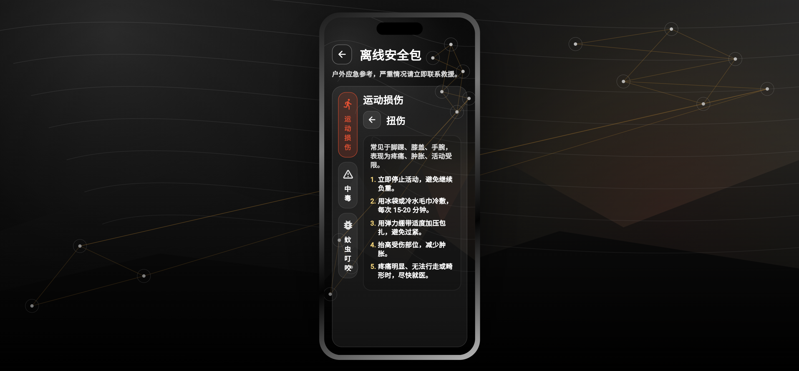

# 行智App —— 一款适合你的户外探索软件
## 基本介绍 
该App适用于户外互助场景，主要实现了以下功能：
- 登录验证
- 一键求助
- 附近互助
- Agent智能答疑
- 紧急联系人
- 健康档案
- 离线安全包
- 天气预警
## 创新点
- 搭建专属户外知识库，可以更好地适配户外场景，保障户外安全
- 附近互助展示附近3km内的求助信息，响应后建立对话
- 一键求助同时联系紧急联系人
- 离线安全包适配无网络应急场景
## 效果图

